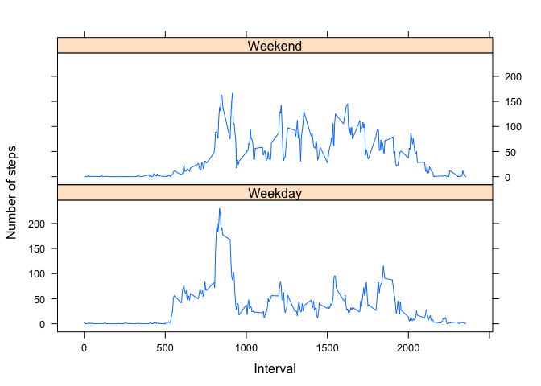

# Reproducible Research: Peer Assessment 1


## Loading and preprocessing the data  
  
>Show any code that is needed to  
1. Load the data (i.e. read.csv())  
2. Process/transform the data (if necessary) into a format suitable for your analysis

Firstly I load (and if neccessary install) required R-code packages


```r
(if ("knitr" %in% installed.packages()) {
    library(knitr)
    opts_chunk$set(echo = TRUE)
} else {
    install.packages("knitr")
    library(knitr)
    opts_chunk$set(echo = TRUE)
})

(if ("ggplot2" %in% installed.packages()) {
    library(ggplot2)
} else {
    install.packages("ggplot2")
    library(ggplot2)
})

(if ("reshape2" %in% installed.packages()) {
    library(reshape2)
} else {
    install.packages("reshape2")
    library(reshape2)
})

(if ("lattice" %in% installed.packages()) {
    library(lattice)
} else {
    install.packages("lattice")
    library(lattice)
})
```

Then I download, unzip and assign the dataset if the data is not found  


```r
if (!"ActivityData" %in% ls()) {
    if (!file.exists("activity.csv")) {
        url <- "https://d396qusza40orc.cloudfront.net/repdata%2Fdata%2Factivity.zip"
        download.file(url, destfile = "ActivityData.zip", method = "curl")
        unzip("ActivityData.zip", "activity.csv")
        ActivityData <- read.csv("activity.csv")
    } else {
        ActivityData <- read.csv("activity.csv", header = T, sep = ",", colClasses = c("numeric", 
            "character", "integer"))
    }
}
```
  
This is the structure of the data, and it looks like it is ready for our next task:  

```
## 'data.frame':	17568 obs. of  3 variables:
##  $ steps   : num  NA NA NA NA NA NA NA NA NA NA ...
##  $ date    : chr  "2012-10-01" "2012-10-01" "2012-10-01" "2012-10-01" ...
##  $ interval: int  0 5 10 15 20 25 30 35 40 45 ...
```
  
  
## What is mean total number of steps taken per day?  

>For this part of the assignment, you can ignore the missing values in the dataset.  
1. Calculate the total number of steps taken per day.  
2. If you do not understand the difference between a histogram and a barplot, research the difference between them. Make a histogram of the total number of steps taken each day.  
3. Calculate and report the mean and median of the total number of steps taken per day.  

1. Total number of steps per day  
  
  First I aggregate steps by date, and assign the grouped sums to "stepsPerDay"


```r
stepsPerDay <- aggregate(steps ~ date, data=ActivityData, FUN=sum)
```
  
2. Histogram (each column represents a group defined by a quantitative variable) of steps per date  
  

```r
ggplot(stepsPerDay, aes(x=steps, fill=..x..)) +
  geom_histogram(binwidth=1000) +
  scale_fill_continuous(low="#F27314", high="#771C19", guide=F) +
  labs(title = "Steps per day", x = "Steps per day", y = "Frequency")
```

 
  
3. Mean and median of total number of steps taken per day  
  
  Mean:  

```r
mean(stepsPerDay$steps)
```

```
## [1] 10766.19
```

Median:   
  

```r
median(stepsPerDay$steps)
```

```
## [1] 10765
```

## What is the average daily activity pattern?

>1. Make a time series plot (i.e. type = "l") of the 5-minute interval (x-axis) and the average number of steps taken, averaged across all days (y-axis).   
>2. Which 5-minute interval, on average across all the days in the dataset, contains the maximum number of steps?  

1. A time series plot of the average number of staps taken in the various 5-min intervals:  
  

```r
stepsPerInterval <- aggregate(steps ~ interval, data=ActivityData, FUN=mean)
plot(stepsPerInterval, type="l")
```

 

2. Interval with the highest average number of steps?  


```r
maxInterval <- stepsPerInterval$interval[which.max(stepsPerInterval$steps)]
maxInterval
```

```
## [1] 835
```


```r
HrClock <- maxInterval%/%60
minClock <- maxInterval%%60
```
If the intervals begin at 00:05 AM the time of day with the highest average activety would be 13:55.  
  
  
## Imputing missing values  

>
Note that there are a number of days/intervals where there are missing values (coded as NA). The presence of missing days may introduce bias into some calculations or summaries of the data.  
>
1.Calculate and report the total number of missing values in the dataset (i.e. the total number of rows with NAs).  
2. Devise a strategy for filling in all of the missing values in the dataset. The strategy does not need to be sophisticated. For example, you could use the mean/median for that day, or the mean for that 5-minute interval, etc.  
3. Create a new dataset that is equal to the original dataset but with the missing data filled in.  
4. Make a histogram of the total number of steps taken each day and Calculate and report the mean and median total number of steps taken per day. Do these values differ from the estimates from the first part of the assignment? What is the impact of imputing missing data on the estimates of the total daily number of steps?  
  
1. Total number of missing values in the dataset:  
  

```r
sum(is.na(ActivityData$steps))  
```

```
## [1] 2304
```
  
2. & 3. creating a new dataset where the missing values are replaced with the interval averages:  

```r
ActivityData2 <- ActivityData
nas <- is.na(ActivityData2$steps)
intervalAvg <- tapply(ActivityData2$steps, ActivityData2$interval, mean, na.rm=T, simplify=T)
ActivityData2$steps[nas] <- intervalAvg[as.character(ActivityData2$interval[nas])]
```
  
Checking that the missing values were replaced correctly.  
  

```r
head(ActivityData$steps[nas])
```

```
## [1] NA NA NA NA NA NA
```

```r
head(tapply(ActivityData2$steps, ActivityData2$interval, mean, na.rm=T, simplify=T))
```

```
##         0         5        10        15        20        25 
## 1.7169811 0.3396226 0.1320755 0.1509434 0.0754717 2.0943396
```

```r
head(tapply(ActivityData2$steps[nas], ActivityData2$interval[nas], mean, na.rm=T, simplify=T))
```

```
##         0         5        10        15        20        25 
## 1.7169811 0.3396226 0.1320755 0.1509434 0.0754717 2.0943396
```

```r
sum(is.na(ActivityData2$steps))
```

```
## [1] 0
```
  
4. Analyzing the data with replaced nans:

Histogram of steps per date:  

```r
stepsPerDay2 <- aggregate(steps ~ date, data=ActivityData2, FUN=sum)
```


```r
ggplot(stepsPerDay2, aes(x=steps, fill=..x..)) +
  geom_histogram(binwidth=1000) +
  scale_fill_continuous(low="#F27314", high="#771C19", guide=F) +
  labs(title = "Steps per day", x = "Steps per day", y = "Frequency")
```

 
  
3. Mean and median of total number of steps taken per day  
  
  Mean:  

```r
mean(stepsPerDay2$steps)
```

```
## [1] 10766.19
```

Median:   
  

```r
median(stepsPerDay2$steps)
```

```
## [1] 10766.19
```
  
The mean and median are now the same. The manipulation of the date to replace the missing values affected the outcome significantly.  
 
  
## Are there differences in activity patterns between weekdays and weekends?  
  
>
For this part the weekdays() function may be of some help here. Use the dataset with the filled-in missing values for this part.  
>
1. Create a new factor variable in the dataset with two levels ??? ???weekday??? and ???weekend??? indicating whether a given date is a weekday or weekend day.
2. Make a panel plot containing a time series plot (i.e. type = "l") of the 5-minute interval (x-axis) and the average number of steps taken, averaged across all weekday days or weekend days (y-axis). See the README file in the GitHub repository to see an example of what this plot should look like using simulated data.  
  
1. Creating the two-level factor variable:  


```r
weekend <- function(date) {
	if(weekdays(as.Date(date)) %in% c("Saturday", "Sunday")) {
		day <- "Weekend"
	} else {
		day <- "Weekday"
	}
}
ActivityData2$weekend <- as.factor(sapply(ActivityData2$date, weekend))
```

A look at the first few rows of the dataset with the new data:  

```r
head(ActivityData2)
```

```
##       steps       date interval weekend
## 1 1.7169811 2012-10-01        0 Weekday
## 2 0.3396226 2012-10-01        5 Weekday
## 3 0.1320755 2012-10-01       10 Weekday
## 4 0.1509434 2012-10-01       15 Weekday
## 5 0.0754717 2012-10-01       20 Weekday
## 6 2.0943396 2012-10-01       25 Weekday
```
  
2. 


```r
library(reshape2)

meltedData <- melt(ActivityData2, measure.vars="steps")

meanSteps <- dcast(meltedData, weekend+interval~variable, mean)

library(lattice)

xyplot(steps~interval|weekend,
	data=meanSteps,
	xlab="Interval",
	ylab="Number of steps",
	type="l",
	layout=c(1,2)
)
```

 
